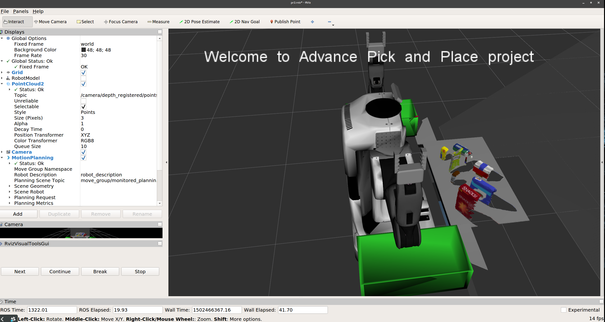

## Project: Perception Pick & Place

# Training
I chose to only train for pick_list3.yaml because the other two test worlds had models that are a subset of pick list 3. I chose to enable HSV filtering to increase accuracy as well as extracting the surface normals. These two feature sets are then concatenated into a single feature vector. I also added iterations to the feature capture script so that a much larger data set would be created. I chose 400 iterations because after this point accuracy does not increase much. I trained with a linear kernel with all other parameters to the classifier as default. Here are the results:

# Recieving Point Cloud Data

I created a ROS node that subscibes to a topic that contains a noisy point cloud sent by the PR2 camera. 
The topic subscribed to by my node is /pr2/world/points. 
Here is a picture of the world points that shows the noisy data:

# Perception Pipeline

The first step in the pipeline (after converting ROS data to PCL)  is to remove extraneous points from the point cloud. This is done by setting up a a filter that filters by observing the data and classifying statistical outliers. any point that does not have a significant amount of neighbors within a specified distance will be considered outliers and removed from the cloud. 

After noise is reduced the cloud can be further procesed by downsampling, this will reduce the number of points in the cloud that need to be dealt with increasing performance without impacting accuracy. I chose to use a very small leaf size, so a majority of the points in the cloud aren't removed. I chose the smallest leaf size I could because my performance was not impacted by it. You will notice the effect of downsampling in some of the following pictures when you see seperated points representing the origional object. 
 
 After downsampling I begin breaking up the cloud into areas of interest. I used a passthrough filter to isolate the table. To do this I set up a filter along the z axis that returns only the points of the table and then segments the cloud with these points by fitting them to a plane model. the resultant points are considered extraced inliers. 
 
 
 
 The objects are isolated in the same maner,  except extracting all the points that are not the table. 
 
 
 
 The next step is to further segment the cloud into individual objects. This is done by first removing the RGB data from the points, and then measureing the distance between the points. A cluster is formed when a group of points all lie within a certain distance of each other, and the cluster has a minimum and maximmum amount of points in it.
 
 Then a list of indices are extracted for each cluster representing an object. 
 For the purposes of fine tuning the parameters, a random color is assigned to each cluster and then published to a ROS topic. 
 
 
 
  
  After going through the above steps, the data is ready to be classified and labeled. This is done by taking the indices created by clusetering and iterating over the origional filtered point cloud with them. Each object pulled form the origional point cloud is then run through the same process used to train the classification model. First the RGB values of each point are converted to HSV, and then the surface normals are extacted from the points. These two feature sets are combined into one feature vector matching one that the training model expects.  At this point a prediction is made about what the classifier thinks the object in the point cloud is and a label is pulled form the model naming the object.  After iterating through all the cluster indices a list of detected objects and their associated labels is created and sent on to the pr2_mover fucntion. 
  
  My pipeline sucessfully classified and labeled all three test scenes with 100% accuracy, here are the results. 
  
#### Test world 1
  
#### Test world 2
  
#### Test world 3
  
## Final Notes

The output yaml files are located in the Udacity_Project_Files folder along with the training set, classifier model, and all relevant scripts. I am very pleased with the results of my pipeline, and it seems fairy robust. If I were to persure the project further I'd definately want to implement the pick and place portion. The script containing the perception steps is called Perception.py. 
  
  
